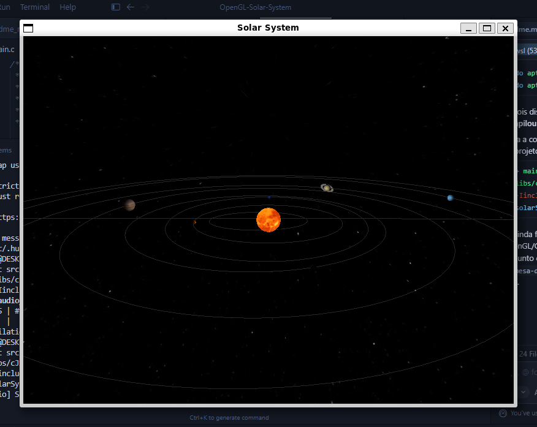
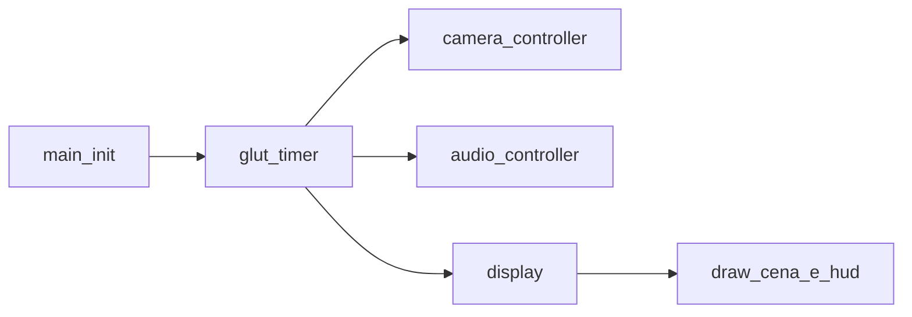

# Sistema Solar em OpenGL

**Trabalho final — Introdução à Computação Gráfica**  
Disciplina ministrada pelo **Prof. Davi Henrique dos Santos**.  
Alunos: Herick, Lusi, Rafael

## Sumário

- [1. Resumo](#resumo)
- [2. Figura do Programa](#figura-do-programa)
- [3. Objetivos](#1-objetivos)
- [4. Conceitos Utilizados](#2-conceitos-de-computação-gráfica-utilizados)
- [5. Modelo Orbital e Escalas](#3-modelo-orbital-e-escalas)
- [6. Arquitetura do Software](#4-arquitetura-do-software)
- [7. Fluxo de Execução](#fluxo-de-execução-visão-geral)
- [8. Requisitos](#5-requisitos)
- [9. Compilação e Execução](#6-compilação-e-execução)
- [10. Controles](#7-controles)
- [11. Estrutura de Diretórios](#8-estrutura-de-diretórios-visão-geral)
- [12. Limitações e Extensões Possíveis](#9-limitações-e-extensões-possíveis)
- [13. Conclusão](#10-conclusão)
- [14. Problemas Encontrados](#11-relatório-principais-problemas-encontrados)
- [15. O que pode ser melhorado](#12-relatório-o-que-pode-ser-melhorado-e-como)
- [16. Contribuição dos Integrantes](#13-relatório-contribuições-dos-integrantes)

---

## Resumo

Este projeto implementa uma cena tridimensional navegável de um sistema solar estilizado em **C/C++** (compilado com `g++`), utilizando **OpenGL** com **GLUT** (janela e parte da entrada), **GLEW** (extensões) e **GLU** (utilitários). A cena combina iluminação por material, texturas (incluindo noite na Terra), órbitas elípticas simplificadas, anéis, fundo estelar e um **HUD** para escolher corpos e modos de câmera. O áudio ambiente é tratado à parte com **SDL2** e **SDL2_mixer** (música em MP3 conforme o foco no HUD). O objetivo é mostrar, de forma didática, como transformação, câmera, iluminação, textura e tempo se integram numa simulação interativa.

### Figura do programa



### Em resumo: o que o programa faz

- Carrega a cena a partir de `configs.json` (corpos, escalas, materiais, caminhos de texturas).
- Abre uma janela com **GLUT**, inicializa **GLEW** e configura iluminação e *depth* no **OpenGL** imediato.
- Entra em um **loop por temporizador**: avança o tempo simulado (`time_sim` × `time_scale`), atualiza a câmera (seguir/órbita) e o áudio conforme o foco no HUD, e redesenha a cena a uma taxa alvo.
- Desenha fundo estelar, Sol, órbitas, planetas (com luas e anéis onde definidos) e o **HUD**; o **SDL2_mixer** toca músicas em `audios/` conforme o corpo selecionado.

**Compilação, execução e dependências detalhadas:** seções **5** e **6** (incluindo pacotes `apt` para WSL/Ubuntu).

**Resumo de dependências:** `g++`, OpenGL, GLU, GLUT (ou FreeGLUT), GLEW, SDL2 e SDL2_mixer.

---

## 1. Objetivos

- Aplicar o **pipeline gráfico fixo** do OpenGL (matrizes modelo/visualização/projeção, `GL_LIGHTING`).
- Descrever corpos celestes em dados externos (**JSON**), ajustando escalas, períodos e aparência sem recompilar.
- Oferecer **interação**: câmera livre, modos **seguir** e **órbita** (spline) ao redor do alvo, pausa da simulação, controle da escala temporal e HUD opcional.
- Integrar **multimídia**: trilha por corpo focado (`audios/<Nome>.mp3`, com *fallback*), com pausa independente da simulação.
- Reforçar leitura visual: Sol com emissão, materiais distintos e sobreposição noturna na Terra orientada à luz.

---

## 2. Conceitos de computação gráfica utilizados

| Tema | Uso no projeto |
|------|----------------|
| **Transformações** | Translação e rotação dos corpos, inclinação orbital, rotação axial e hierarquia planeta–lua. |
| **Câmera** | Modo livre (WASD, mouse, scroll); modo **seguir** com interpolação (`lerp`); modo **órbita** com posição ao longo de uma spline Catmull–Rom ao redor do alvo. |
| **Iluminação** | Modelo de Phong via `glMaterial` (ambiente derivado do difuso, difuso, especular, brilho e emissão). |
| **Texturas** | Mapeamento esférico; normais onde configuradas; textura secundária (noite na Terra, atmosfera em Vênus); anéis com textura dedicada. |
| **Cena e tempo** | Temporizador GLUT; `time_sim` acumulado com `time_scale` para órbitas e rotações; limite de taxa de redesenho. |

---

## 3. Modelo orbital e escalas

As posições orbitais são calculadas em `src/calculus.c` a partir de uma **elipse** no plano XZ, com **excentricidade** e **inclinação** vindas do JSON. O raio instantâneo:

\[
r = \frac{a\,(1 - e^2)}{1 + e\cos\theta}
\]

em que \(a\) é o semi-eixo (escalado por `distance_scale`) e \(e\) a excentricidade. **Não** há integração N-corpos: trata-se de um modelo **kepleriano simplificado** para visualização.

Em `configs.json`, `scale` define `distance_scale`, `radius_scale` e o valor inicial de `time_scale`. Durante a execução, `+`/`-` e `R` alteram `time_scale` no teclado (ver secção 7).

---

## 4. Arquitetura do software

| Módulo | Função |
|--------|--------|
| `main.c` | `load_bodies`, inicialização GLEW/GLUT, `init`, `init_hud`, `init_camera_controller`, `init_audio_controller`, texturas, temporizador (`time_sim`, `update_camera(delta)`, `update_audio`), `display` e *callbacks* de janela. |
| `src/camera_controller.c` | `CameraMode`: `CAMERA_FREE`, `CAMERA_FOLLOW`, `CAMERA_ORBIT`. Seguimento com `lerp_pos`; órbita com spline **Catmull–Rom** e normalização de distância ao alvo. |
| `src/audio_controller.c` | SDL2/SDL2_mixer: reproduz `audios/<nome>.mp3` conforme planeta ou lua focados; *fallback* `audios/default.mp3`; fade in/out; variável global `pause_music`. |
| `src/input.c` | Teclado, mouse, scroll; `init_camera_controller` alinha *yaw*/*pitch* ao `lookAt` inicial; em modo livre, `update_camera()` (sem argumentos, neste arquivo) recalcula `lookAt`; no temporizador do `main`, chama-se `update_camera(delta)` de `camera_controller.c` — são duas funções distintas. |
| `src/bodies.c` | Leitura de `configs.json` com **cJSON** (`libs/cJSON.h`), texturas com **stb_image** (`libs/stb_image.h` + `src/stb_image.c`), parse de corpos, luas e anéis; desenho de **estrelas de fundo**, **órbitas**, malha esférica LOD e **anéis** (`draw_stars_background`, `draw_orbit`, `draw_sphere_lod`, `draw_rings` — declaradas em `include/bodies.h`). |
| `src/calculus.c` | Posições de planetas e luas em função de `time_sim`. |
| `src/draw.c` | `drawBackground` (delega ao fundo em `bodies.c`), **Sol**, **luas** e **planetas**; sobreposição noturna na Terra. |
| `src/hud.c` | Menu lateral: por **planeta**, botões **FOCUS** (seguir) e **SPLINE** (órbita); por **lua**, apenas **FOCUS** (botão de órbita para lua está comentado no código). |
| `src/utils.c` | Utilitários compartilhados. |
| `src/stb_image.c` | Implementação do carregador de imagens. |
| `libs/cJSON.c` | Parser JSON (cabeçalho em `libs/cJSON.h`). |
| `include/structures.h` | Tipos `Body`, `Moon`, `Rings`, `Camera`, `Material`, `CameraMode`, etc. |
| `include/app_state.h` | Declarações `extern` do estado global (escalas, foco, pausa, HUD, música). |
| `include/camera_controller.h` / `include/audio_controller.h` | API dos controladores correspondentes. |
| `include/bodies.h`, `draw.h`, `hud.h`, `input.h`, `calculus.h`, `utils.h` | Declarações das rotinas de carga de cena, desenho de HUD, entrada, cinemática e utilitários. |

**Dados da cena:** `configs.json` descreve o Sol, Mercúrio, Vênus, Terra (e Lua), Marte (Fobos e Deimos), Júpiter, Saturno (anéis), Urano, Netuno e Plutão, além do fundo de estrelas e iluminação global.

**Bibliotecas de terceiros no repositório:**

- [cJSON](https://github.com/DaveGamble/cJSON) — parsing JSON.
- [stb_image](https://github.com/nothings/stb) — imagens para texturas (`libs/stb_image.h`).

**Dependências de sistema:** SDL2 e SDL2_mixer (ligadas na compilação; usadas apenas para áudio, em paralelo ao GLUT).

### Fluxo de execução (visão geral)



---

## 5. Requisitos

- Compilador **C++** (`g++` ou compatível; o projeto usa extensões comuns de compilação mista C/C++).
- **OpenGL**, **GLU**, **GLUT** (ou FreeGLUT) e **GLEW**.
- **SDL2** e **SDL2_mixer** (suporte a MP3 conforme a instalação).
- Execução na **raiz do projeto**, com `configs.json`, pasta `textures/` e, para áudio, pasta `audios/` com arquivos `.mp3` (ou pelo menos `default.mp3`).

### WSL / Ubuntu (instalação de dependências)

No **WSL2** com Ubuntu (ou Debian derivado), instale os pacotes de desenvolvimento antes de compilar. Exemplo com `apt`:

```bash
sudo apt update
sudo apt install -y build-essential \
  libgl1-mesa-dev libglu1-mesa-dev \
  freeglut3-dev libglew-dev \
  libsdl2-dev libsdl2-mixer-dev
```

- **Compilador:** `build-essential` fornece o `g++`.
- **OpenGL / GLU / janela:** `libgl1-mesa-dev`, `libglu1-mesa-dev`, `freeglut3-dev` (o *linker* usa `-lGL -lGLU -lglut`).
- **GLEW:** `libglew-dev`.
- **Áudio:** `libsdl2-dev` e `libsdl2-mixer-dev` (MP3 costuma funcionar com as dependências que o mixer puxa; se faltar *codec*, instale também `libmpg123-dev`).

Para **abrir a janela gráfica** a partir do WSL, use **WSLg** (Windows 11) ou um servidor X no Windows; sem isso o binário compila, mas o GLUT pode falhar ao criar a janela.

---

## 6. Compilação e execução

Comando alinhado ao comentário em `main.c`:

```bash
g++ main.c src/bodies.c src/hud.c src/audio_controller.c src/camera_controller.c libs/cJSON.c src/utils.c src/calculus.c src/input.c src/draw.c src/stb_image.c -Iinclude -o solarSystem -lGL -lGLU -lglut -lGLEW -lSDL2 -lSDL2_mixer
```

Execução (Linux/macOS):

```bash
./solarSystem
```

### Windows

Em **MSYS2 / MinGW**, **vcpkg** ou kits semelhantes, os nomes das bibliotecas e flags de include podem diferir (por exemplo variantes `-lopengl32`, `-lglu32`, `-lfreeglut`, `-lglew32`, `-lSDL2`, `-lSDL2_mixer`). Mantenha a **mesma lista de arquivos `.c`** e ajuste `-I`/`-L` ao seu ambiente.

> **Importante:** execute o binário no diretório que contém `configs.json`, para que `./textures/...` e `./audios/...` sejam encontrados.

---

## 7. Controles

| Entrada | Ação |
|---------|------|
| `W` `A` `S` `D` | Deslocar a câmera no plano horizontal (modo livre). |
| `Q` / `E` | Descer / subir. |
| `Espaço` | Subir (mesmo efeito que `E` no código). |
| Mouse (arrastar) | Orientar a visão (modo livre). |
| Scroll | Aproximar ou afastar (*zoom*). |
| `Shift` (segurar) | Movimento e scroll mais rápidos. |
| `Ctrl` (segurar) | Movimento mais lento. |
| `H` | Mostrar ou ocultar o HUD. |
| `P` | Pausar ou retomar a simulação (ao pausar, `time_scale` vai a 0 e é restaurado ao retomar). |
| `+` ou `=` | Dobrar `time_scale` (até limite interno). |
| `-` | Reduzir `time_scale` para metade. |
| `R` | Repor `time_scale` para `32.0`. |
| `M` | Pausar ou retomar apenas a música (a simulação pode continuar). |
| `Esc` | Sair. |
| HUD — **FOCUS** | Focar planeta ou lua com câmera **seguir** (`CAMERA_FOLLOW`). |
| HUD — **SPLINE** | Focar **planeta** com câmera em **órbita** (`CAMERA_ORBIT`). |
| Clicar de novo no **mesmo botão** (planeta já focado naquele modo) | Remove o foco e volta a `CAMERA_FREE` (`src/hud.c`). |
| Clicar de novo em **FOCUS** na **mesma lua** | Remove o foco da lua (só existe botão FOCUS para luas). |

---

## 8. Estrutura de diretórios (visão geral)

```text
OpenGL-Solar-System/
├── main.c
├── configs.json
├── include/          # cabeçalhos (.h), estado e API
├── src/              # implementação (.c)
├── libs/             # cJSON (c/h), stb_image.h
├── textures/         # texturas referenciadas pelo JSON
├── audios/           # MP3 por corpo (ex.: Sun.mp3) e default.mp3
└── docs/             # relatório: captura (captura.png) e materiais opcionais
```

---

## 9. Limitações e extensões possíveis

- Modelo **visual e didático**, não astronômico: massas, perturbações e efemérides reais não são simuladas.
- Iluminação no estilo OpenGL imediato, **sem** sombras projetadas nem *deferred shading*.
- Áudio depende de **SDL2_mixer** e de arquivos **MP3**; a janela gráfica continua no GLUT.
- Evoluções naturais: shaders GLSL, *skybox* explícito, sombras ou dados orbitais mais realistas.

---

## 10. Conclusão

O trabalho articula teoria de computação gráfica com uma aplicação jogável: configuração por JSON, câmera em três modos, cena iluminada com texturas e um reforço de imersão por áudio. O código permanece organizado por responsabilidades (`draw`, `calculus`, controladores, HUD), o que facilita localizar cada conceito ensinado na disciplina.

---

## 11. Relatório: principais problemas encontrados

Lista **modelo** (substitua ou complemente com os problemas reais que o grupo enfrentou durante o desenvolvimento):

- **WSL sem ambiente gráfico:** o programa compila, mas o GLUT falha ao criar a janela se não houver **WSLg** (Windows 11) ou um servidor X no Windows.
- **Bibliotecas não encontradas no *link*:** erros como `cannot find -lglut` ou `-lGLEW` indicam pacotes `-dev` faltando ou caminho de biblioteca incorreto.
- **Caminhos relativos:** executar o binário fora da pasta raiz faz `configs.json`, `textures/` ou `audios/` não serem encontrados.
- **Áudio MP3:** o SDL2_mixer depende de *plugins* ou bibliotecas de decodificação; em alguns sistemas é necessário instalar `libmpg123-dev` (ou equivalente).
- **Mistura GLUT + SDL:** dois subsistemas distintos (janela vs. áudio); confusão na ordem de inicialização ou em *threads* pode causar comportamento estranho (neste projeto o áudio é atualizado no temporizador do GLUT).

---

## 12. Relatório: o que pode ser melhorado (e como)

| Melhoria | Como |
|----------|------|
| **Pipeline moderno** | Migrar para OpenGL *core profile* com **GLSL**, VBOs/VAOs e um único *context*; reduz dependência de `glBegin`/`glEnd` onde ainda existirem. |
| **Sombras** | Introduzir *shadow mapping* ou sombras projetadas em shader; exige passos de renderização extras e matrizes de luz. |
| **Organização do desenho** | Parte da geometria auxiliar está em `bodies.c`; extrair para um módulo dedicado (ex. `scene_draw.c`) deixa `bodies.c` focado em dados e carga. |
| **Órbita da câmera nas luas** | O segundo botão (órbita) para luas está comentado em `src/hud.c`; reativar e testar com `CAMERA_ORBIT` no clique da lua. |
| **Build** | Adicionar **CMake** ou **Makefile** com alvos `debug`/`release` e detecção de SDL2/GLEW via `pkg-config`. |
| **Qualidade de código** | Remover `printf` duplicados no tratamento de clique do HUD (trecho após focar planeta/lua em `src/hud.c`) e unificar mensagens de *log*. |

---

## 13. Relatório: contribuições dos integrantes

| Nome | Contribuições |
|------|----------------|
| **Rafael de França** | Cena e dados (`configs.json`); desenho 3D — Sol, planetas e luas (`src/draw.c`); primitivas auxiliares de desenho — estrelas, órbitas, esfera LOD, anéis (`src/bodies.c`); câmera livre e entrada (`src/input.c`); documentação e relatório (`README.md`, comentários no código). |
| **Herick José** | Geometria e órbitas (`src/calculus.c`); carga da cena e texturas (`src/bodies.c` — JSON, `load_bodies`, texturas); loop principal e inicialização OpenGL/GLUT/GLEW (`main.c`); estado global e tipos (`include/app_state.h`, `include/structures.h`). |
| **Luis Gustavo** | Geometria e órbitas (`src/calculus.c`); câmera seguir e órbita por spline (`src/camera_controller.c`); HUD e foco (`src/hud.c`); áudio com SDL2_mixer (`src/audio_controller.c`). |
